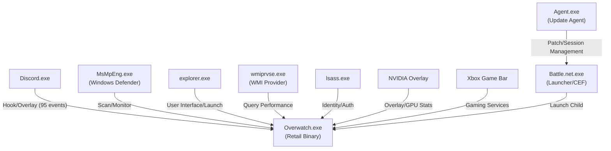
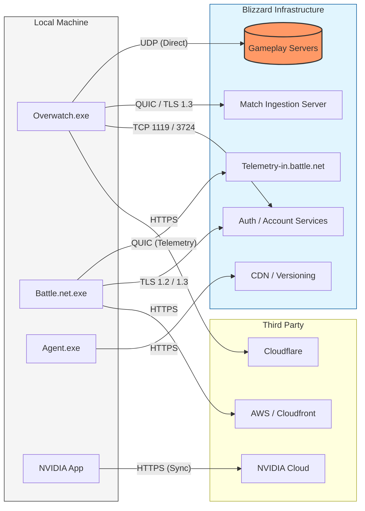
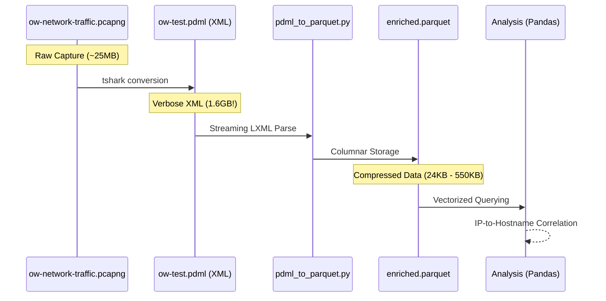

# Overwatch Investigation: Architecture & Interactions

This document contains visual representations of the findings from the Overwatch network and system investigation.

## 1. Local Process Interaction Map
This diagram shows how various system components and third-party applications interact with the main Overwatch process, based on Sysmon telemetry.

## 2. Network Communication & Infrastructure
This diagram maps specific binaries to their identified Blizzard and third-party network endpoints, including protocols.

## 3. Data Analysis Pipeline
The technical workflow used to process the packet captures.

