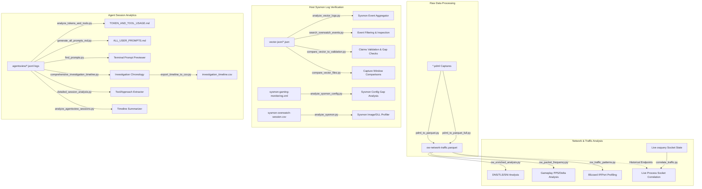

# Summary and Classification of Analysis Scripts

This document provides a comprehensive guide, classification, and summary of all analytical scripts created and used during the **Windows Security & Overwatch Gameplay Analysis** investigation.

These scripts are stored in the root directory and can be executed via `uv run <script_name>.py` (or using python directly in the `.venv` environment).

---

## 🗺️ Architectural Map of Scripts

---

## 1. 🧳 Packet Capture & Traffic Processing Scripts
These scripts are responsible for converting, streaming, and preparing raw packet capture datasets into memory-efficient formats for high-volume analysis.

| Script Name | Purpose | Key Libraries | Features |
| :--- | :--- | :--- | :--- |
| **`pdml_to_parquet.py`** | Converts Wireshark PDML (XML) files into compact Parquet tables. | `lxml.etree`, `pandas` | Uses a memory-efficient XML stream parser to extract frame number, protocol, length, IPs, ports, DNS query names, TLS SNI, ciphers, and QUIC metadata. |
| **`pdml_to_parquet_full.py`** | Memory-optimized parser for extremely large PDML files. | `lxml.etree`, `pandas` | Tailored to process massive packet datasets (like the 1.62 GB `ow-network-traffic.pdml`) without exhausting system memory by writing batches of rows incrementally. |

---

## 2. 🌐 Network & Overwatch Traffic Analysis Scripts
These scripts analyze and profile network telemetry datasets, identifying Blizzard infrastructure footprints and active gameplay traffic characteristics.

| Script Name | Purpose | Key Libraries | Features |
| :--- | :--- | :--- | :--- |
| **`ow_enriched_analysis.py`** | Analyzes application-layer protocols inside traffic captures. | `pandas` | Profiles DNS requests, TLS SNI hostnames, TLS versions, secure ciphers, and QUIC protocol headers to isolate gaming traffic. |
| **`ow_packet_frequency.py`** | Identifies gameplay packets based on timing signatures. | `pandas`, `numpy` | Computes statistical Packets Per Second (PPS) and packet-to-packet delta times to isolate high-frequency UDP bursts typical of active multiplayer matches. |
| **`ow_traffic_patterns.py`** | Isolates traffic flows tied to Blizzard networks. | `pandas`, `numpy` | Filters packets against known Blizzard CIDR subnets (e.g., `24.105.0.0/18`) and analyzes port bounds and server IP occurrences. |
| **`correlate_traffic.py`** | Correlates live sockets with historical network endpoints. | `pandas`, `subprocess`, `json` | Queries live process socket states in real-time via `osquery` and crosses the findings against historical Blizzard endpoint maps from the enriched Parquet capture. |

---

## 3. 🛡️ Host Sysmon Log & System Verification Scripts
These scripts parse historical host event logs (Sysmon) to validate that monitoring rules, processes, and network socket interceptions are functioning as designed.

| Script Name | Purpose | Key Libraries | Features |
| :--- | :--- | :--- | :--- |
| **`compare_vector_to_validation.py`** | Validates baseline claims against complete log data. | `json`, `collections` | Compares Sysmon events in Vector files against original reports, validating process lifecycles, network sockets, DNS queries, and file operations. |
| **`compare_vector_files.py`** | Identifies differences between distinct Vector captures. | `json`, `collections`, `datetime` | Compares two log dumps (`vector-json` vs. `vector-json-old`) to compute differences in event volume, timeline durations, process sets, and DNS requests. |
| **`analyze_vector_logs.py`** | Samples and aggregates basic Vector telemetry events. | `json`, `collections` | Profiles event type distributions, process image counts, and highlights Blizzard DNS queries and Event ID 3 (network connections) within log files. |
| **`search_overwatch_events.py`** | Filters and inspects gaming-related events in log captures. | `json` | Performs high-speed JSON line scans to extract process lifecycles, file modifications, DNS queries, and network connection parameters related to Overwatch. |
| **`analyze_sysmon_config.py`** | Conducts a gap analysis of the target Sysmon configuration. | `xml.etree`, `sys` | Compares Sysmon rules (`sysmon-gaming-monitoring.xml`) against processes and endpoints observed in live validation runs to identify blind spots. |
| **`analyze_sysmon.py`** | Profiles image paths and DLL loads from Sysmon CSV exports. | `pandas`, `re`, `collections` | Parses the `sysmon-overwatch-session.csv` and counts process images and DLL modules loaded in the session using regular expressions. |

---

## 4. 🧠 Agent Session Analytics Scripts
These scripts analyze historical logs of AI agent sessions (e.g., transcripts, tool outputs, token usage, and prompts) to extract metrics, timelines, and logs.

| Script Name | Purpose | Key Libraries | Features |
| :--- | :--- | :--- | :--- |
| **`analyze_tokens_and_tools.py`** | Compiles token metrics and tool usage patterns. | `os`, `json`, `collections` | Scans all raw JSONL transcripts in `agentsview/` (both Claude and Gemini formats), calculates token costs (input, output, cache), and ranks tool calls in `TOKEN_AND_TOOL_USAGE.md`. |
| **`generate_all_prompts_md.py`** | Synthesizes a clean transcript of genuine user prompts. | `os`, `json`, `datetime` | Extracts, cleans, and deduplicates all user-typed instructions from agent logs while filtering out CLI system metadata, saving results in `ALL_USER_PROMPTS.md`. |
| **`find_prompts.py`** | Provides a command-line preview of prompts in log files. | `os`, `json`, `sys` | Performs quick parsing of JSONL logs to print an interactive, truncated, console-safe preview of user prompts directly to the terminal stdout. |
| **`comprehensive_investigation_timeline.py`** | Reconstructs the timeline of the investigation. | `json`, `pathlib`, `re` | Parses all agent transcripts to build a chronological, multiday timeline of the entire investigation, identifying key events and milestones. |
| **`export_timeline_to_csv.py`** | Converts the timeline into a spreadsheet format. | `json`, `csv`, `pathlib` | Outputs the high-resolution chronological investigation timeline into a CSV spreadsheet for analysis. |
| **`detailed_session_analysis.py`** | Maps precise tool calls and debugging approaches. | `json`, `pathlib` | Analyzes session transcripts to extract the exact tools used, error paths, and investigative strategies. |
| **`analyze_agentsview_sessions.py`** | Traces investigative focus hour by hour. | `json`, `pathlib`, `datetime` | Performs timeline summarization on agent logs, reporting tool usage and subject focus hourly. |
