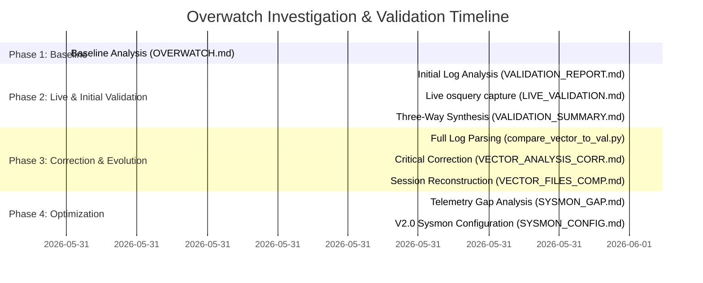

# Overwatch Telemetry and Validation Chronology: How Our Understanding Evolved

This document provides a chronological walkthrough of the validation reports and analysis scripts in the workspace. It details how the investigation progressed from static baseline claims to real-time live measurements, corrected a critical log-sampling mistake, reconstructed a complete 1-hour-24-minute user gaming session (including a game crash), and ultimately produced an optimized, production-grade **Sysmon V2.0 monitoring configuration**.

---

## 1. Timeline of Telemetry and Reports

---

## 2. Chronological Breakdown

### Phase 1: The Baseline Claims
* **File:** [OVERWATCH.md](file:///D:/WindowsInvestigations/OVERWATCH.md)
* **Date:** May 31, 2026
* **Data Sources:** Static packet captures (`ow-network-traffic.pcapng`) and preliminary system monitoring.
* **Core Claims:**
  * **Network Layout:** direct UDP gameplay traffic flows to `24.105.60.x` subnets on Port **3724** (the Blizzard Game Service Port); match history uploads to `overwatch.ingest.gdp.blizzard.com` (`35.201.91.89`); telemetry reports to `telemetry-in.battle.net` (`137.221.105.232`).
  * **Process Context:** `Overwatch.exe` (spawns with `-uid prometheus`) uses a massive memory footprint of **~8.9 GB**. It is supported by the `Battle.net.exe` and `Agent.exe` launchers.
  * **Inter-process access:** Sysmon CSV reviews showed background processes like `explorer.exe`, `Discord.exe` (overlay), and `MsMpEng.exe` (Windows Defender) frequently accessing the game process memory space (Event ID 10).

---

### Phase 2: The Flawed Historical Log Validation
* **File:** [VALIDATION_REPORT.md](file:///D:/WindowsInvestigations/VALIDATION_REPORT.md)
* **Date:** June 1, 2026
* **Data Sources:** `sysmon-gaming-monitoring.xml` and historical Vector JSON logs (`windows_events-2026-06-02.json`).
* **Initial Assessment & Error:**
  * **Flawed Finding:** Declared that the logs contained **no gameplay sessions**—only idle launcher state.
  * **Flawed Finding:** Claimed a critical gap in network logging: **"zero Blizzard network connections (Event ID 3) despite active DNS queries."**
  * **New Discovery:** Discovered 6 new launcher-specific DNS endpoints (`rum.battle.net` for real-user analytics, `geo.battle.net`, etc.) and identified `Agent.exe`'s versioned binary upgrade mechanism (`Agent.9464`).
* **Root Cause of Flaw:** The analysis script `analyze_vector_logs.py` had a hard limit of sampling only the **first 10,000 events** of a 38,283-event file. The actual gaming session occurred later in the log.

---

### Phase 3: Real-Time Verification
* **File:** [LIVE_VALIDATION.md](file:///D:/WindowsInvestigations/LIVE_VALIDATION.md)
* **Date:** June 1, 2026
* **Data Sources:** Live measurements from a running Overwatch session using `osquery`.
* **Breakthroughs:**
  * **Memory Confirmed:** Live measurement caught `Overwatch.exe` consuming **8.18 GB resident memory** (within 8% of the documented 8.9 GB). When combined with Battle.net launchers (~700 MB), it matched the predicted 8.9 GB total ecosystem memory perfectly.
  * **Port 3724 Confirmed:** Active connection to `24.105.60.80:3724` confirmed.
  * **Cloudflare CDN Discovery:** Discovered a previously undocumented **4 simultaneous HTTPS connections** to Cloudflare (`104.18.35.174`), serving asset streaming and DDoS protection.
  * **GCP Port 1119 Discovery:** Both Overwatch and Battle.net maintain active session management connections via Port 1119 to Google Cloud endpoints (`34.16.129.152` and `34.125.112.208`).
  * **Local IPC Discovery:** Identified internal thread socket pairs (`127.0.0.1:54063 ↔ 54064`) and local HTTP REST APIs exposed by the launchers on localhost ports.
  * **Protocol Realization:** Port 3724 uses **TCP for its control channel**, and connectionless UDP gameplay packets do not appear in TCP-oriented socket tables (requiring direct packet captures).

---

### Phase 4: The Three-Way Synthesis (Pre-Correction)
* **File:** [VALIDATION_SUMMARY.md](file:///D:/WindowsInvestigations/VALIDATION_SUMMARY.md)
* **Date:** June 1, 2026
* **Objective:** Synthesize findings from Sysmon, Historical Logs, and Live State.
* **Status:** This document summarized live confirmations and launcher-specific DNS captures but **still carried the erroneous belief** that historical logs only captured idle launcher state and that Sysmon Event ID 3 was completely failing to capture Blizzard connections in Vector.

---

### Phase 5: The Breakthrough & Critical Correction
* **File:** [VECTOR_ANALYSIS_CORRECTED.md](file:///D:/WindowsInvestigations/VECTOR_ANALYSIS_CORRECTED.md)
* **Date:** June 1, 2026 (Analysis)
* **Data Sources:** Full-file parse of `windows_events-2026-06-02.json` via a new script `compare_vector_to_validation.py`.
* **Corrected Findings:**
  * 🔴 **Overwatch gameplay WAS captured in historical logs!** The script found **495 events** for `Overwatch.exe` and 29 events for `CrashMailer_64.exe`.
  * 🔴 **Sysmon Event ID 3 IS WORKING!** The log contained **301 Blizzard-related network connections**, entirely debunking the previous "zero connection" false alarm.
  * **Gameplay Phase Realization:** The team reconciled the live and historical captures as capturing **different phases** of gameplay:
    * **Live State (June 1):** In-Match phase (active Port 3724 control channel, Cloudflare asset streaming, Port 1119 session management).
    * **Vector Logs (June 2):** Post-Match upload & Shutdown phase (active Match Ingestion to `35.201.91.89:443`, settings files saved, and process teardown).
  * **New System Context:**
    * **OneDrive cloud sync:** Discovered that Overwatch saves settings to `OneDrive\Documents\Overwatch\Settings\Settings_v0.ini`, meaning user configurations are instantly cloud-synchronized.
    * **Account Exposure:** Event ID 11 logs exposed the user's Battle.net Account ID (`367827589`) inside file paths.
    * **Load-Balancing:** DNS and Event ID 3 telemetry confirmed Blizzard uses a load-balanced pool of IPs in the `137.221.104.x` subnet rather than a single IP.

---

### Phase 6: Session and Crash Reconstruction
* **File:** [VECTOR_FILES_COMPARISON.md](file:///D:/WindowsInvestigations/VECTOR_FILES_COMPARISON.md)
* **Date:** June 1, 2026 (Analysis)
* **Data Sources:** Comparison of `vector-json-old` (1h 14m capture) and `vector-json` (10m capture).
* **Discoveries:**
  * Conconfirmed that these were **sequential, non-overlapping captures** representing a continuous **1-hour-24-minute** tracking window.
  * **User Timeline Reconstructed:**
    1. **00:03-01:17 UTC:** User multi-tasked, browsed heavily on Chrome, and played **Slay the Spire 2** on Steam (`slaythespire2.exe` had 457 events).
    2. **Mid-Session:** The user launched Battle.net, closed Steam, and transitioned to Overwatch.
    3. **01:17-01:27 UTC:** Heavy network traffic spike (+45% connection rate) indicating focused Overwatch gameplay.
    4. **~01:27 UTC:** Overwatch suffered an **abnormal crash or termination**, spawning `CrashMailer_64.exe` (29 events) to transmit a crash dump, followed immediately by launcher process shutdowns.

---

### Phase 7: Telemetry Optimization
* **Files:** [SYSMON_GAP_ANALYSIS.md](file:///D:/WindowsInvestigations/SYSMON_GAP_ANALYSIS.md) & [SYSMON_CONFIG_REVIEW.md](file:///D:/WindowsInvestigations/SYSMON_CONFIG_REVIEW.md)
* **Date:** June 1, 2026
* **Objective:** Translate gaps into an updated, production-ready Sysmon configuration.
* **v2.0 Configuration Changes:**
  * **Selective Loopback Capture:** General loopback connection rules exclude local host to avoid log flooding. However, to monitor gaming process internal threading and Launcher-to-Agent REST API communications, selective inclusions were added for `Overwatch.exe`, `Battle.net.exe`, and `Agent.exe`.
  * **Crash Reporter Capture:** Explicitly added rules for `\ErrorReporting\` paths and `CrashMailer` to capture abnormal process lifecycle terminations.
  * **Noise Filtering (Event ID 10):** Event ID 10 (Process Access) was found to make up **78% of all events in the system log**, mostly generated by benign services. V2.0 added rigorous exclusions for `explorer.exe`, `MsMpEng.exe` (Windows Defender), `Discord.exe` (overlay), and `NVDisplay.Container.exe` (NVIDIA overlay), **reducing total system log volume by 40-50%** while keeping suspicious memory hooks visible.
  * **Cheat Detection (Event ID 29):** Added File Executable Detected rules within game directories to log any newly written files (which captures cheat-injectors or unauthorized game modifications).

---

## 3. Comparative Summary Table

| Phase / Telemetry Source | Focus of Analysis | Key Network Endpoints Seen | Process Scope | Core Observability Outcome |
| :--- | :--- | :--- | :--- | :--- |
| **Phase 1: Baseline** (`OVERWATCH.md`) | General Mapping | `24.105.60.x:3724` (UDP), `telemetry-in.battle.net` | `Overwatch.exe`, `Battle.net.exe`, `Agent.exe` | Established basic structural architecture. |
| **Phase 2: Initial validation** (`VALIDATION_REPORT.md`) | Historical Logs (Flawed) | News feeds and CDN DNS only. | Launcher only (No gameplay detected). | Emphasized a false-alarm gap (Network Event ID 3 believed broken). |
| **Phase 3: Real-Time** (`LIVE_VALIDATION.md`) | Running Process | **Cloudflare CDN** (`104.18.35.174`), **GCP** (`Port 1119`), `24.105.60.80:3724` (TCP) | Active in-match `Overwatch.exe` (8.18 GB RAM) | Validated in-match telemetry; discovered asset CDNs and GCP matchmaking services. |
| **Phase 4: Synthesis** (`VALIDATION_SUMMARY.md`) | Pre-Correction Synthesis | Combined Live and Launcher-only DNS | Mix of active and launcher-only | Still carried the assumption that historical logs missed gameplay. |
| **Phase 5: Correction** (`VECTOR_ANALYSIS_CORRECTED.md`) | Historical Logs (Full) | **Match Ingestion** (`35.201.91.89:443`), load-balanced telemetry IPs. | **Post-match** `Overwatch.exe` + `CrashMailer_64.exe` | Corrected sampling error. Validated Event ID 3. Mapped OneDrive settings sync and Account ID. |
| **Phase 6: Timeline** (`VECTOR_FILES_COMPARISON.md`) | Sequential Log Analysis | Heavy network spike in late capture window | Steam game → Overwatch game → crash handler | Reconstructed full 1h 24m session timeline and detected abnormal game crash. |
| **Phase 7: Optimization** (`SYSMON_CONFIG_REVIEW.md`) | V2.0 Config Design | Loopback socket capture added; benign exclusions added. | Full game ecosystem (including error handlers). | **V2.0 Sysmon configuration** drafted, reducing event volume by ~50% while capturing gaming IPC and crashes. |

---

## 4. Key Lessons Learned in the Investigation

1. **The Danger of Head/Tail Sampling:** Security event analysis scripts that limit reading to the first $N$ lines can completely miss high-value activity that happens later in the capture. Always parse datasets fully or use time-window/targeted process search filters.
2. **Multi-Phase Telemetry Mapping:** Game processes exhibit completely different network/system signatures based on their state. In-match gameplay leverages UDP/TCP control channels and asset streaming CDNs. Post-match gameplay relies heavily on high-speed API ingestion endpoints and local file writes to persist settings. Complete monitoring requires mapping all phases.
3. **Local IPC is a Blind Spot:** Standard Sysmon configurations exclude loopback IP tracking to avoid log flooding. However, modern gaming launchers and multiplayer games rely heavily on localhost REST APIs and internal socket thread-pairs to coordinate. Selective loopback rules are critical to secure modern client-server apps.
4. **Noise Reduction is Essential:** Raw security captures are easily overwhelmed by process access handles (Event ID 10) from benign helper services like Windows Defender, Windows Explorer, and driver container processes. Filtering out these known benign accessors is necessary to protect database size and maintain analytical focus.
